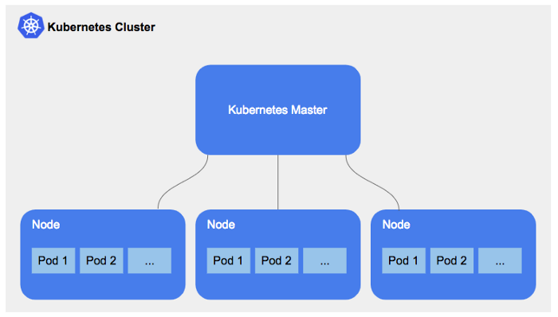

# Kubernetes (K8)

## What is K8
Kubernetes is a container orchestration platform for scheduling and automating the deployment, management, and scaling of containerized applications.
It is a containerisation orchestration tool that that facilitates both declarative
configuration and automation. It is widely available and enables convenient management of a lot of
different containerisation services. Kubernetes manages containers for over 69% of companies.

## Benefits of K8 and why should we use it?
Kubernetes provides you with a framework to run distributed systems resiliently. It takes care of scaling and failover for your application, provides deployment patterns, and more. For example, Kubernetes can easily manage a canary deployment for your system.

- **Service discovery and load balancing:** Kubernetes can expose a container using the DNS name or using their own IP address. If traffic to a container is high, Kubernetes is able to load balance and distribute the network traffic so that the deployment is stable.
- **Storage orchestration:** Kubernetes allows you to automatically mount a storage system of your choice, such as local storages, public cloud providers, and more.
- **Automated rollouts and rollbacks:** You can describe the desired state for your deployed containers using Kubernetes, and it can change the actual state to the desired state at a controlled rate. For example, you can automate Kubernetes to create new containers for your deployment, remove existing containers and adopt all their resources to the new container.
- **Automatic bin packing:** You provide Kubernetes with a cluster of nodes that it can use to run containerized tasks. You tell Kubernetes how much CPU and memory (RAM) each container needs. Kubernetes can fit containers onto your nodes to make the best use of your resources.
- **Self-healing:** Kubernetes restarts containers that fail, replaces containers, kills containers that don't respond to your user-defined health check, and doesn't advertise them to clients until they are ready to serve.
- **Secret and configuration management:** Kubernetes lets you store and manage sensitive information, such as passwords, OAuth tokens, and SSH keys. You can deploy and update secrets and application configuration without rebuilding your container images, and without exposing secrets in your stack configuration.

## Competitors of K8
The following link provides more detail on the competitors for K8 `https://www.clickittech.com/devops/kubernetes-alternatives/`
- Amazon ECS
- Docker Swarm
- RedHat OpenShift
- Nomad
- AWS Fargate
## Managed services for K8
The following link provides more detail on the managed services for K8 `https://techgenix.com/top-managed-kubernetes-services/`
- Google Kubernetes Engine (GKE)
- Amazon Elastic Kubernetes Service (EKS)
- Microsoft Kubernetes Azure (AKS)
- IBM Cloud Kubernetes Service
- Oracle Container Engine for Kubernetes
- DigitalOcean Kubernetes

## What is the difference between K8 managed service and non-managed K8 services
When we deploy a cluster through kubeadm, kubespray, or even by doing it manually (the hard way), you have full access to the cluster and master all the other related management components. You’ll also have more control over the deployment and administration of your cluster. For example, you can implement multiple node groups or choose to have different instance types for different nodes. These options are not available with many Kubernetes managed services.

The following link provides more detail on the non-managed services for K8 `https://www.magalix.com/blog/provider-managed-vs.-self-managed-kubernetes`
- Kubespray
- Kubeadm
- Kops
- Kubetail
- Kubewatch
- Prometheus
- HELM
